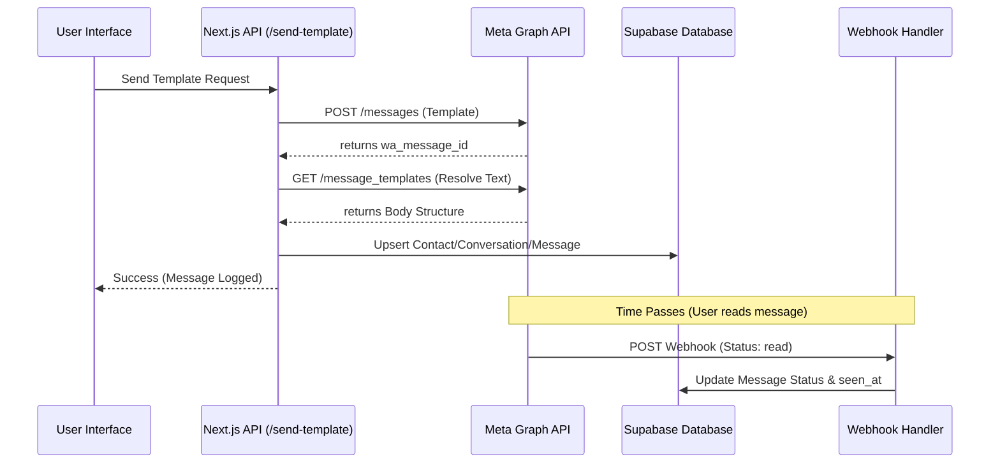

# WhatsApp UI Implementation Documentation

## 1. Project Overview
This project is a multi-tenant WhatsApp Business Dashboard built using Next.js. it allows users to manage their WhatsApp Business API configurations, send template messages, track message delivery status, and communicate with contacts via a unified inbox.

## 2. Tech Stack
- **Frontend**: Next.js (App Router), React, Tailwind CSS, Lucide React (Icons).
- **Backend**: Next.js Route Handlers (API Routes).
- **Database & Auth**: Supabase (PostgreSQL with RLS and Auth).
- **WhatsApp Integration**: Meta WhatsApp Cloud API (Graph API v19.0).

---

## 3. Core Directory Structure
- `src/app/`: Next.js App Router pages and API routes.
- `src/lib/`: Core logic, including WhatsApp API integration (`whatsapp.ts`) and Supabase client setup.
- `src/components/`: Reusable UI components.
- `src/context/`: React Context for global state management (`AppContext.jsx`).
- `src/pages_mock/`: Implementation of the main application pages (Overview, Inbox, Tracker, etc.).

---

## 4. WhatsApp Integration Logic (`src/lib/whatsapp.ts`)
This file contains the core functions for interacting with Meta's Graph API:
- `sendWhatsAppMessage`: Sends a plain text outbound message.
- `sendWhatsAppTemplate`: Sends a structured template message.
- `fetchWhatsAppTemplates`: Retrieves all approved templates from the WhatsApp Business Account (WABA).
- `resolveTemplateFinalText`: A critical helper that fetches the template structure from Meta and replaces placeholders (e.g., `{{1}}`, `{{2}}`) with actual parameter values for internal logging/display.

---

## 5. Flow of Execution: Template Messages

### A. Fetching Templates
When the user visits the **Tracker** page:
1. The `AppContext` triggers a fetch to `/api/templates`.
2. The route handler retrieves the user's `waba_id` and `access_token` from the `whatsapp_configs` table.
3. It calls `fetchWhatsAppTemplates` which queries Meta's `message_templates` endpoint.
4. The approved templates are returned and displayed in the UI.

### B. Sending Template Messages
The system or an external trigger calls `POST /api/send-template`:
1. **Validation**: Checks for mandatory fields (`to`, `templateName`).
2. **Meta API Call**: Invokes `sendWhatsAppTemplate` to dispatch the message via Meta's Cloud API.
3. **Text Resolution**: Since Meta only returns a message ID and doesn't store the full text with parameters, the backend calls `resolveTemplateFinalText`. This fetches the template body and merges it with the provided parameters to generate the "actual" message content.
4. **Data Persistence**:
   - **Contact/Conversation**: If it's a new contact, it upserts records in `contacts` and `conversations`.
   - **Message Log**: Saves the outbound message to the `messages` table with the `wa_message_id` returned by Meta and the resolved content.
5. **Response**: Returns the local message ID and the resolved text.

### C. Webhook & Status Updates
Meta sends real-time updates to `src/app/api/webhook/[userId]/route.ts`:
1. **Status Updates**: When a message is `delivered` or `read`, Meta sends a webhook payload.
2. **Database Sync**: The handler matches the `wa_message_id` in the `messages` table and updates the `status`, `delivered_at`, or `seen_at` timestamps.
3. **External Message Backfilling**: If a status update is received for a message NOT in the local database (e.g., sent via another tool), the webhook handler "backfills" it. It identifies it's a template from the pricing category, fetches the template body from Meta, and creates a local record so it appears in the Dashboard/Inbox.

---

## 6. Database Schema Summary
- **`whatsapp_configs`**: Stores Meta API credentials (tokens, IDs) per user.
- **`contacts`**: Stores contact information (phone number, name).
- **`conversations`**: Groups messages between a user and a contact.
- **`messages`**: Stores individual messages, their direction (`inbound`/`outbound`), content, and delivery status.

---

## 7. Execution Flow Diagram (Simplified)

