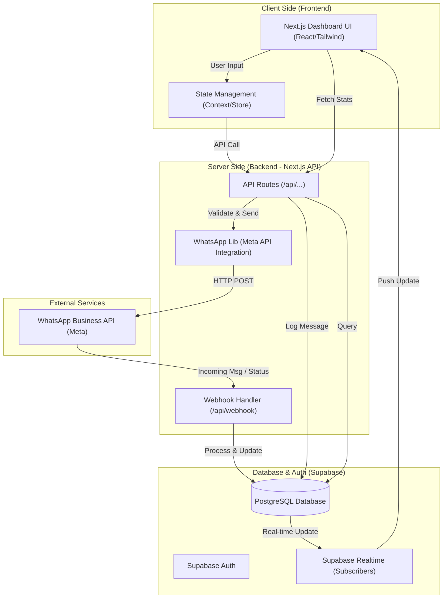

# Project Architecture

Aapke project ka architecture ek modern full-stack application hai jo Next.js aur Supabase par based hai. Neeche iska flowchart aur detailed explanation hai.

## Architecture Flowchart

## Architecture Details (Hindi)

1.  **Frontend (Next.js & Tailwind CSS)**:
    *   Ye user interface hai jise aap `src/app` aur `src/components` mein dekh sakte hain.
    *   **Dashboard**: Messages dikhane aur templates manage karne ke liye.
    *   **State Management**: `src/lib/store.ts` aur Context API ka use karke app ka state maintain kiya jata hai.

2.  **Backend (Next.js API Routes)**:
    *   Aapka backend `src/app/api` directory mein hai.
    *   **Webhooks**: Meta se aane wale messages aur status updates (`/api/webhook`) ko handle karta hai.
    *   **Message Sending**: `/api/send-message` aur `/api/send-template` jaise routes WhatsApp API se interact karte hain.

3.  **Database (Supabase/PostgreSQL)**:
    *   Saara data (messages, contacts, templates, analytics) Supabase mein store hota hai.
    *   **Real-time Updates**: Jab database mein koi naya message aata hai, Supabase Realtime ke zariye UI apne aap update ho jata hai.

4.  **External Integration (Meta API)**:
    *   Ye core service hai jo actual WhatsApp messages deliver karti hai.
    *   `src/lib/whatsapp.ts` mein Meta API ke sath communication ki saari logic hai.

## Key Workflows

*   **Message Sending**: User UI par message likhta hai -> API route call hota hai -> Meta API ko request jati hai -> Database mein "Sent" status save hota hai.
*   **Webhook Handling**: Jab koi reply aata hai, Meta aapke `/api/webhook` par notification bhejta hai -> Backend usse parse karke DB mein save karta hai -> UI automatically update hota hai.
